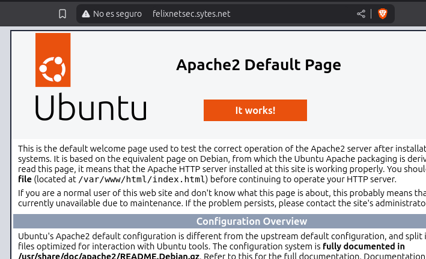
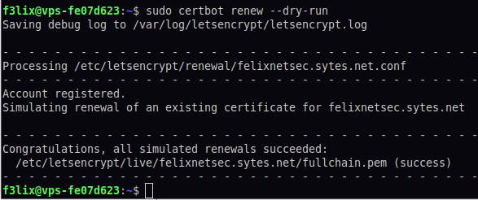

# Proyecto 9: Certificados digitales


Por: Félix Sánchez González
## Índice

- [Configuración Inicial de VPS en OVHcloud](#configuración-inicial-de-vps-en-ovhcloud)
  - [Creación de Usuario](#creación-de-usuario)
  - [Configuración de SSH](#configuración-de-ssh)
    - [Generación de Clave SSH](#generación-de-clave-ssh)
    - [Configuración del Cliente SSH](#configuración-del-cliente-ssh)
    - [Copia de Clave SSH al Servidor](#copia-de-clave-ssh-al-servidor)
  - [Configuración Segura de SSH](#configuración-segura-de-ssh)
    - [Opciones de Configuración](#opciones-de-configuración)
    - [Cambios de Configuración Aplicados](#cambios-de-configuración-aplicados)
  - [Despliegue de Apache2](#despliegue-de-apache2)
  - [Instalación de Certificado SSL/TLS](#instalación-de-certificado-ssltls)
  - [Tipos de errores en los certificados SSL/TLS](#tipos-de-errores-en-los-certificados-ssltls)
    - [Certificado para un host diferente (NET::ERR_CERT_COMMON_NAME_INVALID)](#certificado-para-un-host-diferente-neterr_cert_common_name_invalid)
    - [Certificado caducado (NET::ERR_CERT_DATE_INVALID)](#certificado-caducado-neterr_cert_date_invalid)
    - [Autoridad de certificación no válida (NET::ERR_CERT_AUTHORITY_INVALID)](#autoridad-de-certificación-no-válida-neterr_cert_authority_invalid)
    - [Versión SSL/TLS o conjunto de cifrado no coinciden (ERR_SSL_VERSION_OR_CIPHER_MISMATCH)](#versión-ssltls-o-conjunto-de-cifrado-no-coinciden-err_ssl_version_or_cipher_mismatch)


## Configuración Inicial de VPS en OVHcloud


### Creación de Usuario

Se alquiló una vps en el hosting de: [OVHcloud](www.ovhcloud.com/)


Para mejorar la seguridad, se creó un nuevo usuario:

```bash
sudo adduser f3lix
```

Y se añadió al grupo sudo:

```bash
sudo adduser f3lix sudo
```

## Configuración de SSH

### Generación de Clave SSH

Se creó una clave ssh desde mi equipo de escritorio:

```bash
ssh-keygen -t rsa -b 4096 -C "clave_servidor_ovh"
```


### Configuración del Cliente SSH

Añadir una entrada en `~/.ssh/config` para el cliente de ssh:


### Copia de Clave SSH al Servidor

Se copió la clave ssh al servidor para autenticarnos:


```bash
ssh -i /home/felix/.ssh/id_ed25519 f3lix@51.38.190.43
```


## Configuración Segura de SSH

### Opciones de Configuración

Añadió las siguientes opciones al archivo `/etc/ssh/sshd_config`:

```ssh
PermitRootLogin no
LoginGraceTime 30
MaxAuthTries 3
MaxStartups 3
AllowUsers f3lix
Protocol 2
AllowTCPForwarding no
X11Forwarding no
PasswordAuthentication no
PubkeyAuthentication yes
PermitEmptyPasswords no
UsePAM yes
ChallengeResponseAuthentication no
LogLevel VERBOSE
Ciphers aes256-ctr,aes192-ctr,aes128-ctr
MACs hmac-sha2-512,hmac-sha2-256
KexAlgorithms curve25519-sha256,diffie-hellman-group14-sha256
ClientAliveInterval 300
ClientAliveCountMax 2
```

Se cambió la siguiente opción:

```ssh
X11Forwarding no
```

<br/><br/>

### Cambios de Configuración Aplicados

Se aplicaron los siguientes cambios para mejorar la seguridad del servidor SSH:

- **Autenticación por clave**: Se habilitó exclusivamente la autenticación mediante claves SSH, deshabilitando el acceso por contraseña.
    
- **Restricción de usuarios**: Se limitó el acceso SSH únicamente al usuario `f3lix`.
    
- **Protección contra ataques de fuerza bruta**:
    
    - `LoginGraceTime` reducido a 30 segundos.
        
    - `MaxAuthTries` limitado a 3 intentos.
        
    - `MaxStartups` establecido en 3 conexiones simultáneas.
        
- **Algoritmos criptográficos robustos**:
    
    - `Ciphers`: `aes256-ctr, aes192-ctr, aes128-ctr`
        
    - `MACs`: `hmac-sha2-512, hmac-sha2-256`
        
    - `KexAlgorithms`: `curve25519-sha256, diffie-hellman-group14-sha256`
        
- **Gestión de sesiones inactivas**:
    
    - `ClientAliveInterval`: 300 segundos.
        
    - `ClientAliveCountMax`: 2 intentos.
        
- **Otras medidas de seguridad**:
    
    - Deshabilitado el acceso root (`PermitRootLogin no`).
        
    - Desactivado el reenvío X11 y TCP.
        
    - Nivel de registro detallado (`LogLevel VERBOSE`).

<br/><br/><br/>Por ultimo se hace una prueba:
        

## Despliegue de Apache2


Para desplegar Apache2, se ejecutaron los siguientes comandos:

```bash
sudo apt install apache2
systemctl start apache2
systemctl enable apache2
systemctl status apache2 # Para comprobar si se ha desplegado correctamente
```



&nbsp;


### Añadir web

Se ha cambiado la página web de /var/www/html/index.html por una de ejemplo.


Se puede observar que al no tener un certificado TLS/SSL el navegador nos avisa de que la web "no es seguro". 
&nbsp;

## Instalación de Certificado SSL/TLS

Para la instalación del certificado SSL/TLS, se usó Certbot, que gestiona automáticamente la creación de certificados de la CA Let's Encrypt.


Se siguieron las instrucciones de la web de Certbot: [https://certbot.eff.org/instructions?ws=apache&os=snap](https://certbot.eff.org/instructions?ws=apache&os=snap)

```bash
sudo snap install --classic certbot
```

<br/>


Los certificados de Let's Encrypt caducan cada 90 días, por lo que es necesario revisar que esté activado el timer.

  
<br/>

Alternativemente se puede configurar un comando en cron para el proceso de regeneración de los certificados:

```bash
echo "0 0,12 \* \* \* root /opt/certbot/bin/python -c 'import random; import time; time.sleep(random.random() \* 3600)' && sudo certbot renew -q" | sudo tee -a /etc/crontab > /dev/null
```

Revisar el auto renovación:

  
<br/>Finalmente, se revisó el estado del certificado desde la web www.ssllabs.com, donde los resultados fueron satisfactorios:
<br/>

## Tipos de errores en los certificados SSL/TLS

Para explicar los tipos de errores que podemos encontrar en los certificados SSL/TLS, se ha usado la web https://badssl.com/, donde podemos encontrar ejemplos de certificados TLS con diferentes problemas para analizarlos.
<br/><br/>

### Certificado para un host diferente (NET::ERR_CERT_COMMON_NAME_INVALID)

El error NET::ERR_CERT_COMMON_NAME_INVALID ocurre porque el certificado SSL emitido para \*.badssl.com no cubre el subdominio wrong.host.badssl.com. Esto se debe a que los certificados con comodín solo validan un nivel de subdominio, y "wrong.host" tiene dos niveles. El navegador muestra esta advertencia para alertar sobre una posible configuración incorrecta o un riesgo de seguridad, protegiendo al usuario de conexiones inseguras.


### Certificado caducado (NET::ERR_CERT_DATE_INVALID)

El error **NET::ERR_CERT_DATE_INVALID** ocurre cuando el certificado SSL de un sitio web ha caducado, como en el caso de *expired.badssl.com*. Cada certificado tiene un período de validez definido, y si no se renueva a tiempo, los navegadores lo rechazan por considerarlo inseguro. Este error también puede presentarse si la fecha y hora del dispositivo del usuario están mal configuradas, lo que provoca que el navegador interprete incorrectamente la validez del certificado. Ante esta advertencia, es recomendable evitar continuar en el sitio ya que podría representar un riesgo para la seguridad de tus datos.


### Autoridad de certificación no válida (NET::ERR_CERT_AUTHORITY_INVALID)

El error **NET::ERR_CERT_AUTHORITY_INVALID** ocurre cuando el certificado SSL del sitio no ha sido emitido por una autoridad de certificación reconocida. Esto puede deberse a que el certificado es autofirmado, proviene de una entidad no confiable o falta en la lista de autoridades confiables del sistema operativo o navegador. Este tipo de advertencia indica que la conexión podría no ser segura, y es recomendable evitar ingresar información sensible en el sitio.


### Versión SSL/TLS o conjunto de cifrado no coinciden (ERR_SSL_VERSION_OR_CIPHER_MISMATCH)

El error **ERR_SSL_VERSION_OR_CIPHER_MISMATCH** ocurre cuando el navegador no puede establecer una conexión segura con el servidor debido a incompatibilidades en la versión de SSL/TLS o en las suites de cifrado utilizadas. Esto puede deberse a configuraciones obsoletas del servidor, certificados inválidos o el uso de protocolos y cifrados que los navegadores modernos ya no admiten. También puede originarse por problemas en el dispositivo del usuario, como un navegador desactualizado o configuraciones de seguridad restrictivas. Este mensaje es una advertencia de que la conexión no es segura y podría exponer los datos a riesgos.

